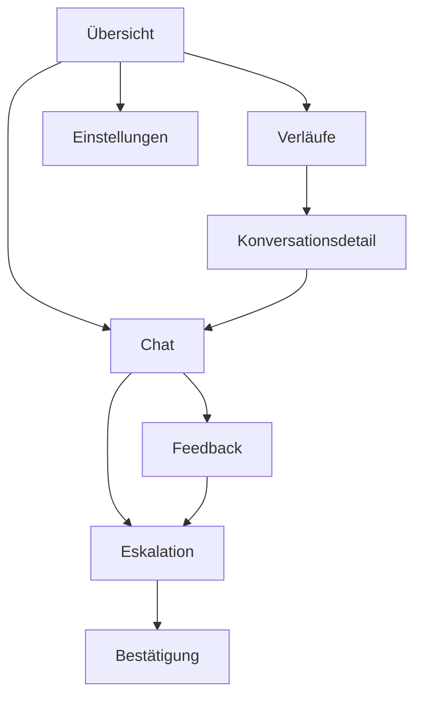
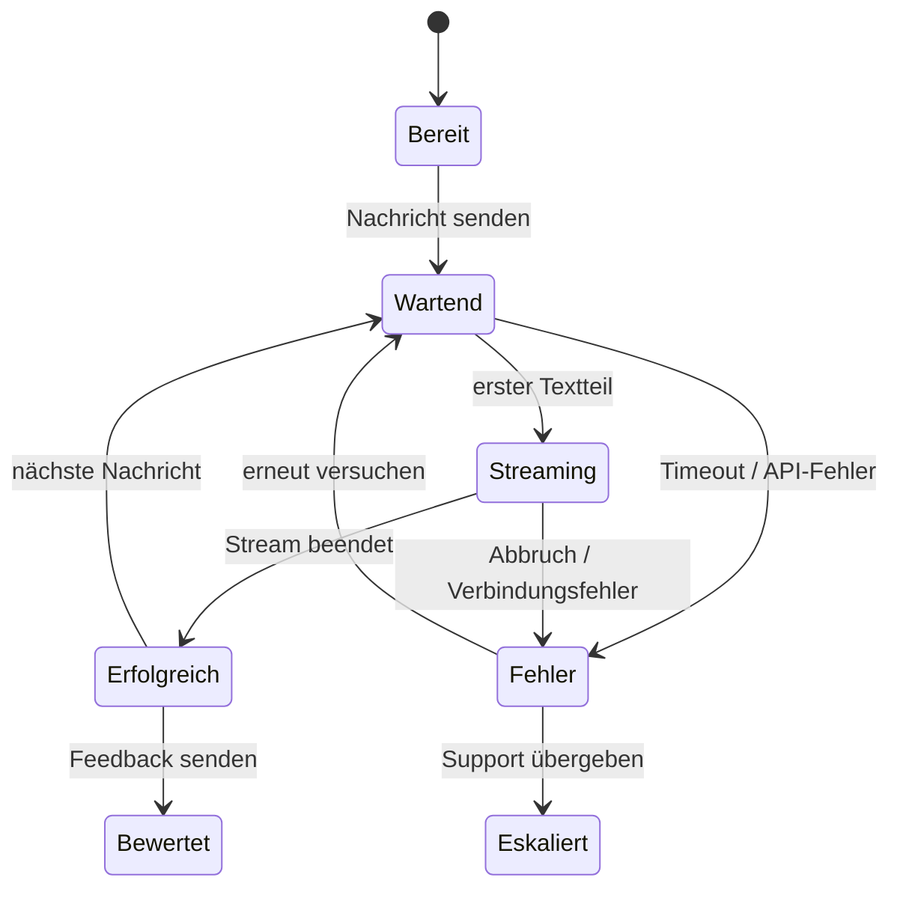

# HZ2 – Entwurf und KI-Interaktionskonzept

## 1. Wireframe-Umfang

Die Datei `mockups/SupportBotAI_Mockups.bmpr` enthält 15 importierbare Balsamiq-Boards:

1. Übersicht/Start
2. Chat Variante A – minimal
3. Chat Variante B – reichhaltig, ausgewählt
4. Chat – KI antwortet
5. Chat – Timeout/Fehler
6. Chat – Spracheingabe aktiv
7. Konversationsdetail
8. Eskalationsformular
9. Eskalation – Validierungsfehler
10. Eskalation – Bestätigung
11. Feedback
12. Einstellungen/Barrierefreiheit
13. Einstellungen – hoher Kontrast/grosser Text
14. Screen-Flow
15. Zustands-Flow

Damit sind alle sechs Pflichtscreens, zwei Chatvarianten und die KI-spezifischen Zustände abgedeckt.

## 2. Vergleich der Chatvarianten

| Kriterium | Variante A – minimal | Variante B – reichhaltig |
|---|---|---|
| Aufbau | nur Verlauf, Eingabe, Senden | Verlauf plus Konversationen, Schnellfragen und Antwortdetails |
| Stärke | sehr geringe visuelle Belastung | mehr Orientierung, Transparenz und direkte Kontrollmöglichkeiten |
| Risiko | KI-Herkunft und Eskalation können übersehen werden | höhere Informationsdichte auf kleinen Geräten |
| Peter | leicht verständlicher Einstieg | Schnellfragen reduzieren Eingabeaufwand |
| Lea | zu wenig Kontext und Kontrolle | Quellenkontext, Feedback, Retry und Eskalation sichtbar |
| Nora | kurze Fokusfolge | zusätzliche Elemente, aber logisch gruppiert und beschriftet |
| Entscheidung | verworfen | **umgesetzt** |

Variante B wurde ausgewählt, weil die KI-spezifischen Risiken Transparenz und Kontrolle wichtiger machen als maximale Reduktion. Auf schmalen Bildschirmen werden die beiden Seitenspalten ausgeblendet; der Kern bleibt dadurch so kompakt wie Variante A.

## 3. Gestalt- und Styleguide-Begründung

- **Nähe:** Nachrichtentext, Zeit, KI-Label, Kontext und Feedback sind in einer gemeinsamen Karte gruppiert.
- **Ähnlichkeit:** alle primären Aktionen sind türkis gefüllt, sekundäre Aktionen umrandet und destruktive Aktionen rot.
- **Gemeinsamer Bereich:** Sidebar, Chat und Antwortdetails sind als klar getrennte Karten erkennbar.
- **Visuelle Hierarchie:** Seitentitel → Status/Erklärung → Arbeitsbereich → Nebeninformationen.
- **Konsistenz:** Navigation, Kartenradien, Abstände, Schriftstufen und Fokusrahmen bleiben seitenübergreifend gleich.
- **Nicht nur Farbe:** Status, Rollen und Fehler werden immer zusätzlich textlich bezeichnet.
- **Progressive Disclosure:** Demo-Werkzeuge sind in einem zugeklappten `details`-Element untergebracht.

## 4. KI-spezifische Interaktionsmuster

### Transparenz

- Produktname **SupportBot AI** statt eines menschlichen Namens
- Badge **KI-CHAT** und Textlabel **KI-GENERIERT** an jeder Antwort
- Hinweis auf mögliche Fehler direkt über dem Verlauf
- verwendeter Kontext als Text; keine Scheingenauigkeit durch erfundene Prozentwerte

### Warten und Streaming

Nach dem Senden wird eine leere KI-Nachricht mit einem animierten Ladeindikator erstellt. Eingehende Textteile werden unmittelbar angehängt. Der Chatbereich hat `aria-busy=true`, bis der Stream endet. Dadurch ist sowohl visuell als auch assistiv nachvollziehbar, dass die App arbeitet.

### Fehler und Timeout

Die Nutzerfrage bleibt gespeichert. Statt eines technischen Stacktraces erscheint eine handlungsorientierte Meldung mit **Erneut versuchen** und **An Support übergeben**. Ein absichtlich steuerbarer Timeout ermöglicht einen reproduzierbaren Grenzfall in der Präsentation.

### Feedback

Nach jeder erfolgreichen KI-Antwort stehen **Ja** und **Nein**. Eine Folgeseite erlaubt einen optionalen Kommentar und die direkte Kombination mit menschlichem Support.

### Eskalation

Die Übergabe ist nicht erst im Fehlerfall sichtbar. Das Formular erklärt Pflichtformate, zeigt eine Zusammenfassung und lässt den Nutzer entscheiden, ob der Verlauf angehängt wird. Nach dem Absenden wird eine Ticketnummer bestätigt.

## 5. Screen-Flow

## 6. Chat-Zustandsmodell

## 7. Abgleich Wireframe und Umsetzung

Die umgesetzte Oberfläche folgt Variante B: linke Verlaufsspalte, zentraler Chat und rechte Transparenzspalte. Abweichungen sind begründet:

- Auf mobilen Breiten werden Nebenspalten verborgen, damit Eingabe und Nachrichten Vorrang haben.
- Confidence-Prozentwerte wurden bewusst nicht umgesetzt, weil das Modell keine kalibrierte Zuverlässigkeitszahl liefert.
- „Quellen“ heissen **Kontext**, da die Informationen aus einem fiktiven Systemkontext und nicht aus nachprüfbaren externen Dokumenten stammen.
- Der Demo-Timeout ist zugeklappt, damit er normale Nutzende nicht belastet.

